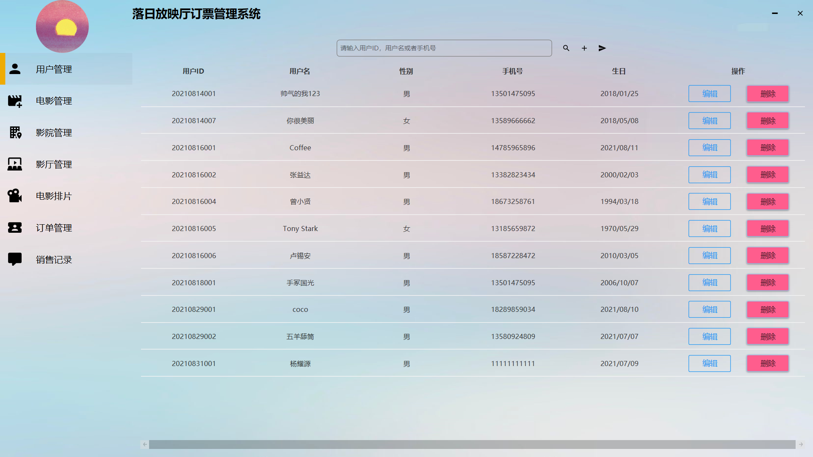
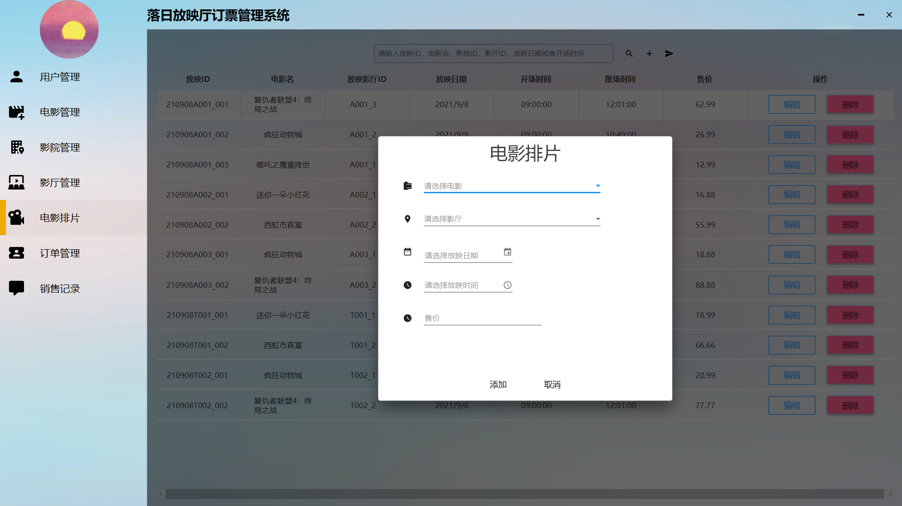
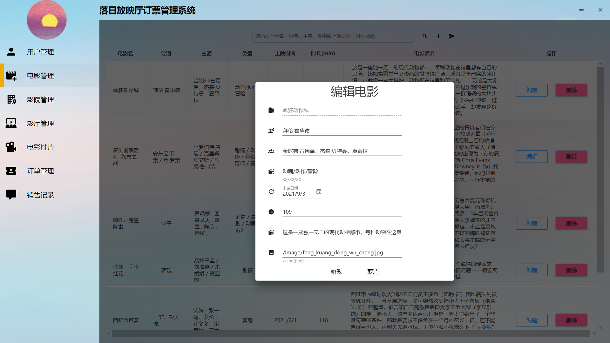
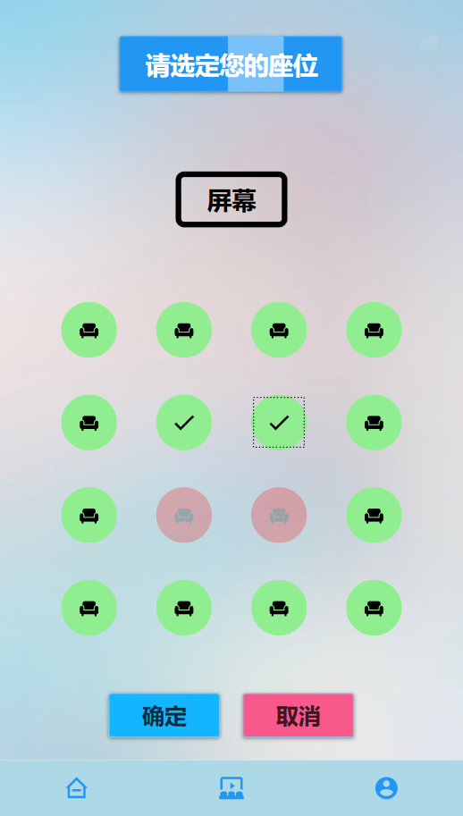
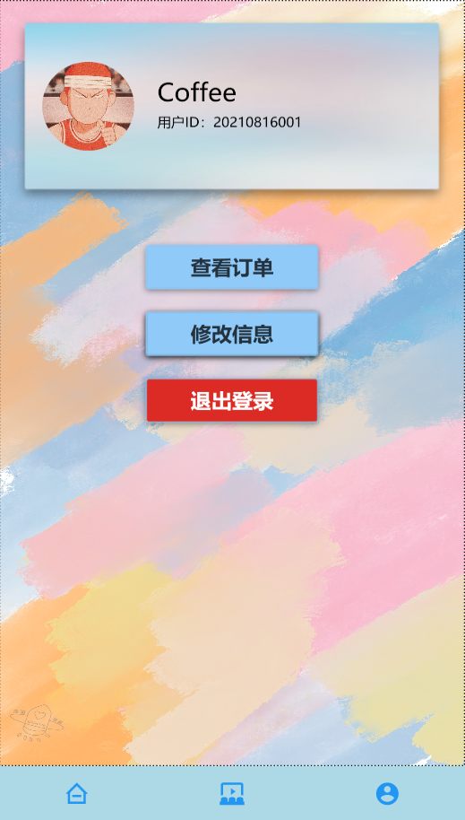
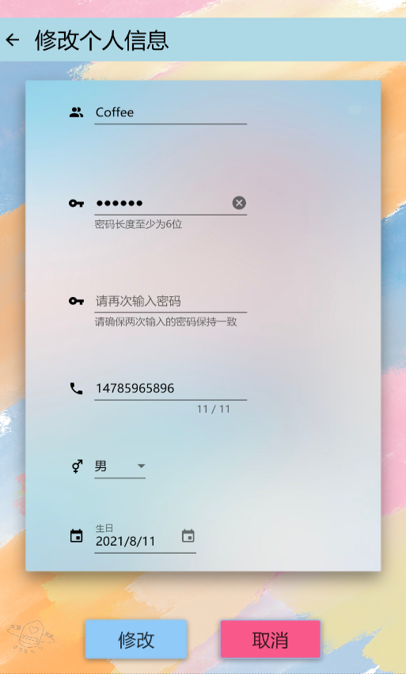

# Theater

## 简介
这是一个用C#编写的**电影订票系统**，包括前端仿手机界面的订票系统，以及后端管理系统。具有**完善的基本功能**，**友好的交互设计**，**美观的界面**。其中还有更多板块功能等待有缘人开发。

## 使用说明
\Theater\bin\Debug 文件中打开 Theater.exe 文件，即可运行登陆界面。

### 管理端界面
账户密码均为：admin，登入后会进入到管理端

有以下页面：
1. 用户管理
2. 电影管理
3. 影院管理
4. 影厅管理
5. 电影排片
6. 订单管理
7. 销售记录

前6个页面均有**搜索**、**添加**、**编辑**功能，第7个页面为统计数据

### 用户界面
可以注册账户，并且登录。
**用户信息界面**：

点击电影对应行的空白处可查看**电影详情**：

点击购票，选择影院以及时间（这个页面在这里没有展示），**购票选座位**

购买成功后，用户可以在**用户信息界面**进入“**我的订单**”查看

用户也可以**修改信息**：

## 运行提示
如果要修改代码，注意需要把**代码中连接数据库文件**的路径一下。原本这里弄相对路径就没事了，但是除了bug还没解决，只能用绝对路径。主要就是前端和后端两个主界面的文件的对应C#代码需要修改好数据库的路径。

## 改进想法
1. 在做这个的时候，慢慢地接触到MVVM模式。但是因为时间不足，工程过半，只有继续按原来那样做下去。后面希望能用MVVM模式修改项目代码逻辑，使得前端后端分工更加清晰，工作效率更高
2. 界面还留有较多功能，如推荐页面，点赞，评分，评论，退票，远程连接等，等待开发中。